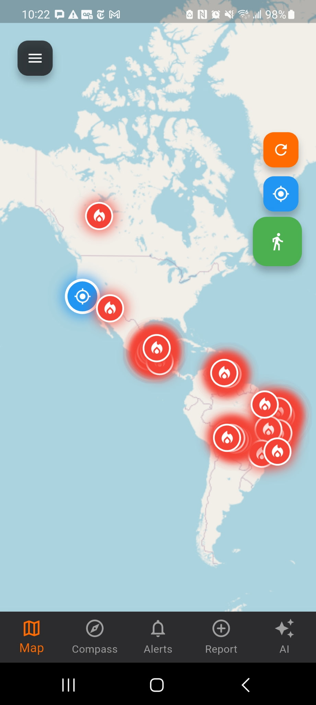
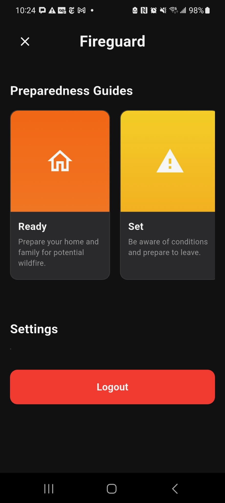
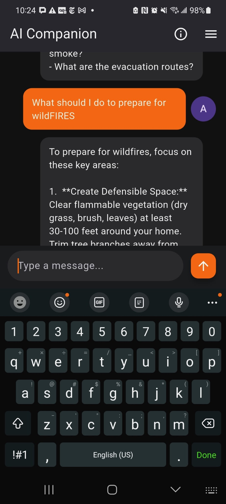
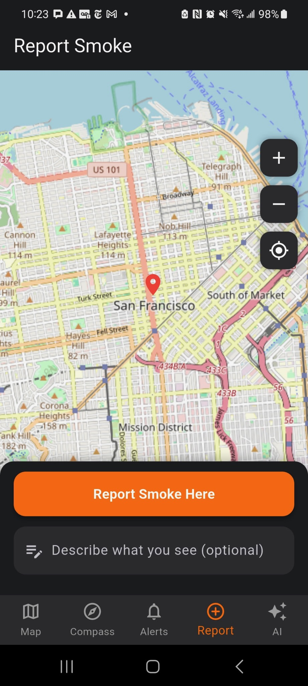
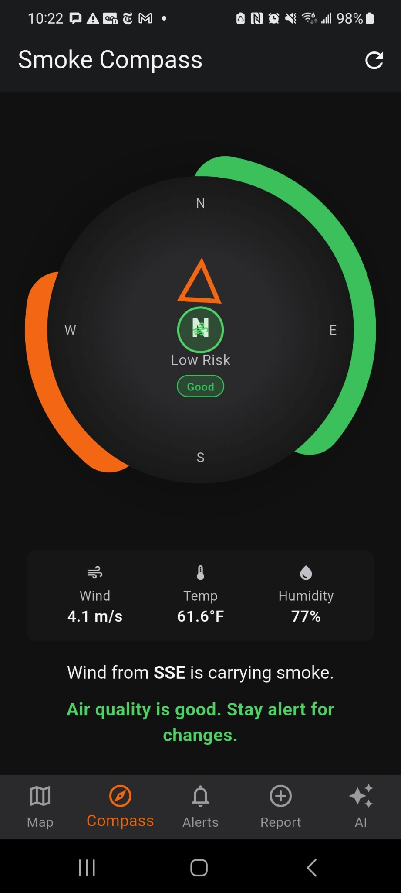
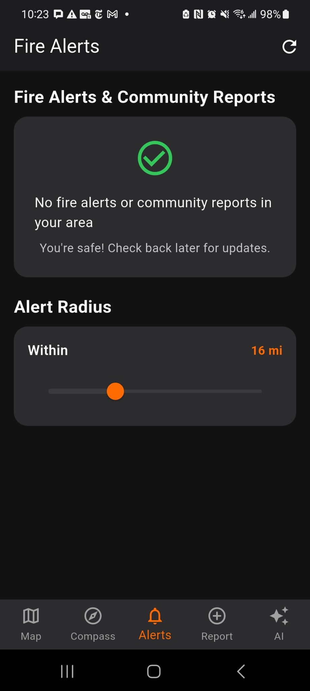
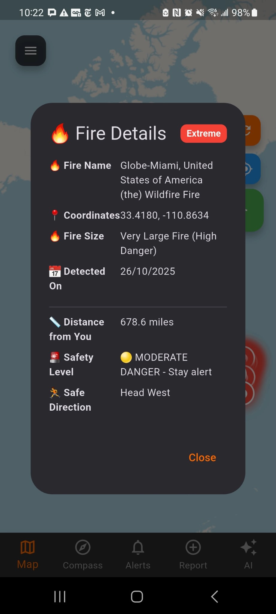

# FireGuard

California is a culmination of constant and devastating natural disasters. One of which affects nearly everyone in the state: wildfires. Not only are they extremely destructive, but they also claim thousands of deaths across the state. All the same, we are in a time where the world runs on the greatest technologies humankind has ever created, like Artificial Intelligence, serverless computing, and real-time processing. Thus, in a crisis like such, lacking effective tools and services made me question the value of these new and trending technologies. To dispel this doubt, I created FireGuard, an app that aims to address this problem by applying the aforementioned services. This powerhouse application uses real-time wildfire data from credible sources such as NASA FIRMS API, CAL FIRE, and OpenWeatherMap to not only raise awareness but also provide an immediate call to action. A user can set a self-defined radius and receive alerts when danger is nearby. However, the most important goal I had in mind while creating this app was to actually make this app useful in times of crisis, to have practicality included. Many apps focus on avoidance and passive actions, but I wanted to create something you can use in the moment you are in danger. Therefore, I came up with my own novel feature: Smoke Compass. This feature allows users to navigate heavily smoke-filled areas using a compass that uses real-time air quality data to guide them toward safer areas. Moreover, there is also a crowdsourcing feature that takes benefit of the beautiful California community to allow anyone to report a fire (however minor) to keep everyone safe and secure. Additionally, in the AI era, it is crucial to leverage the latest AI features, which is why I integrated the Gemini API into an AI Chatbot within the app to assist users with any fire-related questions they may have. By implementing guardrails for AI and a user-centric approach to actionable features, I hope FireGuard can be deployed to assist the citizens of California.

